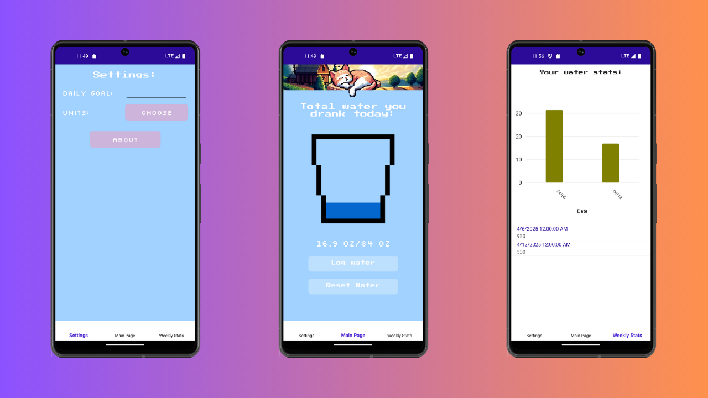

# 🐈 WaterCat

A simple and cool mobile app to track water drinking!


---



---

### Table of Contents
- [Cloning Repository](#cloning-repository)
- [Building Project](#building-project)
- [Run Locally](#run-locally)
- [Contributing](#contributing)
- [Support](#support)
- [Appendix](#appendix)

---

### Cloning Repository

To clone repository, use Git clients like Tower or GitKraken, or type:
```commandline
$ git clone https://github.com/pazurkota/watercat.git
```

---

### Building Project

1. Install [.NET 8.0 SDK](https://dotnet.microsoft.com/en-us/download)
2. Install .NET MAUI workload:
```commandline
dotnet workload install maui
```
3. Verify and install missing components with `maui-check`:
```commandline
dotnet tool install -g redth.net.MAUI.check
```
```commandline
maui-check
```
4. Build the project:
```commandline
dotnet build
```
---

### Run Locally

#### If using Android or iOS Emulator:

1. Make sure you have properly configured emulator:
    - [Android](https://learn.microsoft.com/en-us/dotnet/maui/android/emulator/debug-on-emulator?view=net-maui-8.0)
    - [iOS (Mac)](https://learn.microsoft.com/en-us/dotnet/maui/ios/cli?view=net-maui-8.0)
    - [iOS (Windows)](https://learn.microsoft.com/en-us/dotnet/maui/ios/remote-simulator?view=net-maui-8.0)
2. Run the project:
    - For Android: ```dotnet build -t:Run -f net8.0-android```
    - For iOS: ```dotnet build -t:Run -f net8.0-ios```

#### If using physical device:

1. Make sure you have properly configured device:
    - [Android](https://learn.microsoft.com/en-us/dotnet/maui/android/device/setup?view=net-maui-8.0)
    - [iOS (Mac Only)](https://learn.microsoft.com/en-us/dotnet/maui/ios/pair-to-mac?view=net-maui-8.0)
2. Run the project:
    - For Android: ```dotnet build -t:Run -f net8.0-android```
    - For iOS: ```dotnet build -t:Run -f net8.0-ios```

---

### Contributing

Pull requests are always welcome! For major changes, please open an issue first to discuss what you would like to change.

---

### Support

If you encounter a bug, have a suggestion, or experience a similar issue, please open a new issue and provide a detailed description. When filling out the issue form:

- Specify the nature of the issue (e.g., bug, feature request).
- Indicate the target platform (Android or iOS).
- Describe the problem in detail.
- For bugs, provide step-by-step instructions to reproduce the issue.

---

### Appendix

The banner at the top of the app has been generated by Artificial Intelligence (AI)