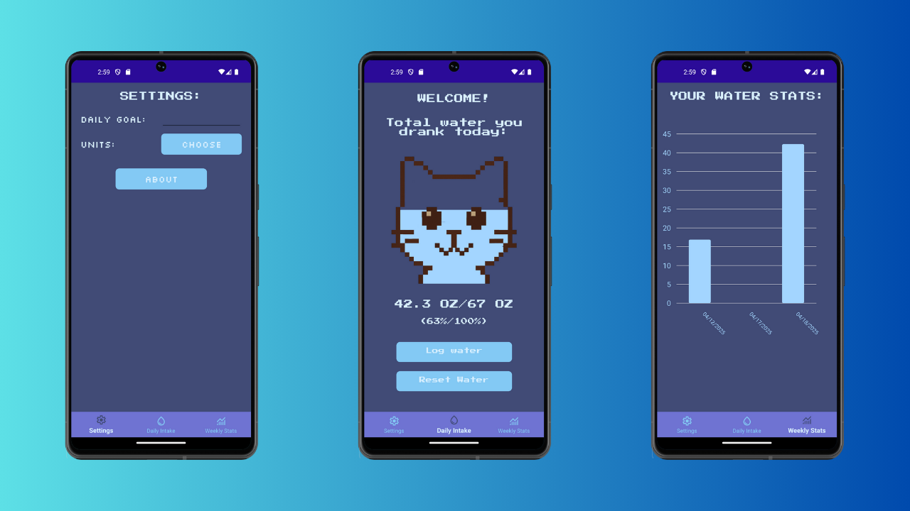

# 🐈 WaterCat

**Stay hydrated with style.**

WaterCat is a sleek and simple mobile app that helps you track your daily water intake.


---



---

### 📚 Table of Contents
- [✨ Features](#-features)
- [📥 Cloning the Repository](#-cloning-the-repository)
- [🔧 Building the Project](#-building-the-project)
- [🚀 Running Locally](#-running-locally)
- [🤝 Contributing](#-contributing)
- [🛠️ Support](#-support)
- [📎 Appendix](#-appendix)

---

### ✨ Features
- 🚰 Track Daily Water Intake – Log each glass and keep your hydration on point.
- ⚖️ Choosable Units (ml or oz) – Prefer ounces over milliliters? You decide!
- 📊 Weekly Progress Visualization – See how your hydration habits stack up over the week.
- 📱 Cross-Platform – Built with .NET MAUI to support both Android and iOS.
- 🎯 Customizable Goals – Set your own daily water intake target.
- 🐾 Cute, Minimal UI – A cat-themed design that’s both aesthetic and functional.

---

### 📥 Cloning the Repository

Clone the repo using your preferred Git client (like Tower or GitKraken) or via the command line:
```commandline
$ git clone https://github.com/pazurkota/watercat.git
```

---

### 🔧 Building the Project

1. Install [.NET 8.0 SDK](https://dotnet.microsoft.com/en-us/download)
2. Install .NET MAUI workload:
```commandline
dotnet workload install maui
```
3. Verify and install missing components with `maui-check`:
```commandline
dotnet tool install -g redth.net.MAUI.check
```
```commandline
maui-check
```
4. Build the project:
```commandline
dotnet build
```
---

### 🚀 Running Locally

#### 🧪 Using an Emulator:

1. Make sure you have properly configured emulator:
    - [Android](https://learn.microsoft.com/en-us/dotnet/maui/android/emulator/debug-on-emulator?view=net-maui-8.0)
    - [iOS (Mac)](https://learn.microsoft.com/en-us/dotnet/maui/ios/cli?view=net-maui-8.0)
    - [iOS (Windows)](https://learn.microsoft.com/en-us/dotnet/maui/ios/remote-simulator?view=net-maui-8.0)
2. Run the project:
```bash
# For Android
dotnet build -t:Run -f net8.0-android

# For iOS
dotnet build -t:Run -f net8.0-ios 
```

#### 📱 Using physical device:

1. Make sure you have properly configured device:
    - [Android](https://learn.microsoft.com/en-us/dotnet/maui/android/device/setup?view=net-maui-8.0)
    - [iOS (Mac Only)](https://learn.microsoft.com/en-us/dotnet/maui/ios/pair-to-mac?view=net-maui-8.0)
2. Run the project:
```bash
# For Android
dotnet build -t:Run -f net8.0-android

# For iOS
dotnet build -t:Run -f net8.0-ios 
```

---

### 🤝 Contributing

Pull requests are always welcome!
For larger changes, consider opening an issue first to discuss your ideas.

---

### 🛠️ Support

Found a bug? Have a feature request? Please open a new issue and include:

- Type of issue (e.g. bug, enhancement)
- Target platform (Android or iOS)
- Detailed description
- Repro steps (for bugs)

Your feedback helps make WaterCat better for everyone!

---

### 📎 Appendix

Water fill image has been generated by AI